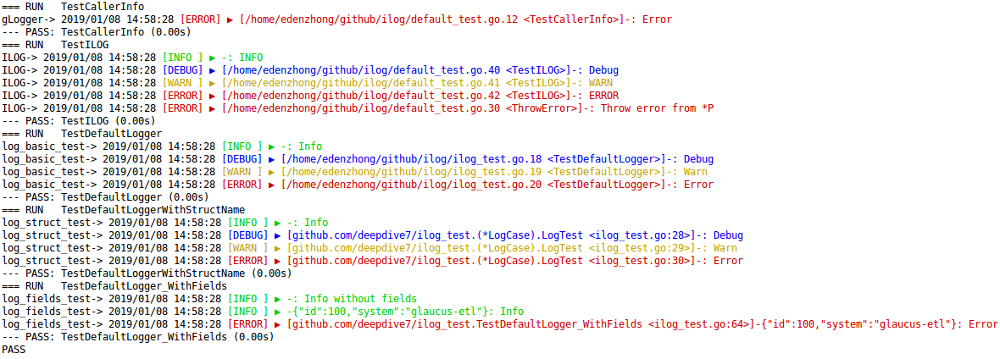

# ilog
## 支持接口
- SetLevel(lvl Level)
- Deeper(delta int)
- SetPrefix(prefix string)
- WithField(name string, value interface{}) error
- WithFields(fields map\[string\]interface{}) error
- AddReceiver(receiver *Receiver)
- Debug(a ...interface{})
- Info(a ...interface{})
- Warn(a ...interface{})
- Error(a ...interface{})
- Fatal(a ...interface{})
- Debugf(format string, a ...interface{})
- Infof(format string, a ...interface{})
- Warnf(format string, a ...interface{})
- Errorf(format string, a ...interface{})
- Fatalf(format string, a ...interface{})
- Panic(a ...interface{})
- Panicf(format string, a ...interface{})

## 截图

